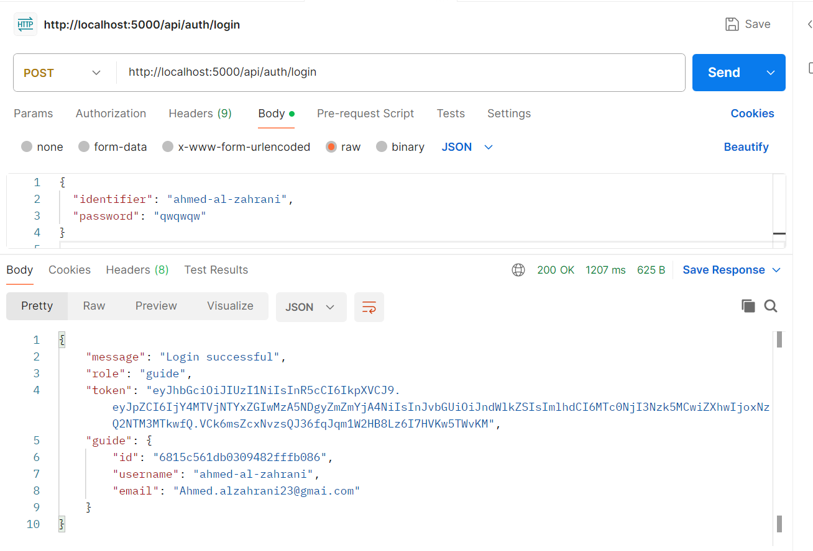
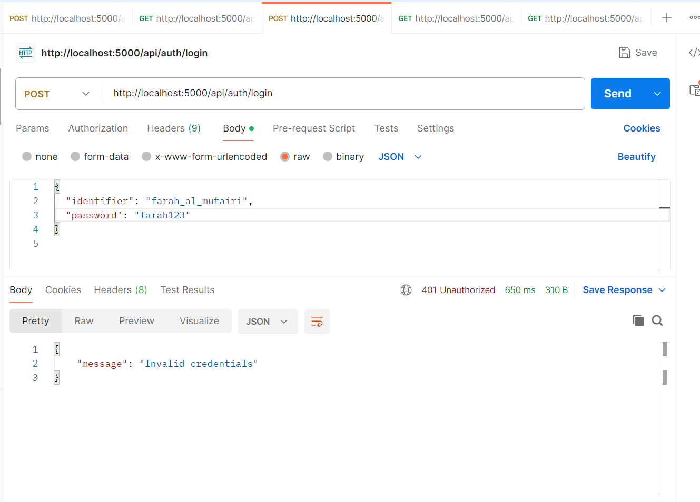
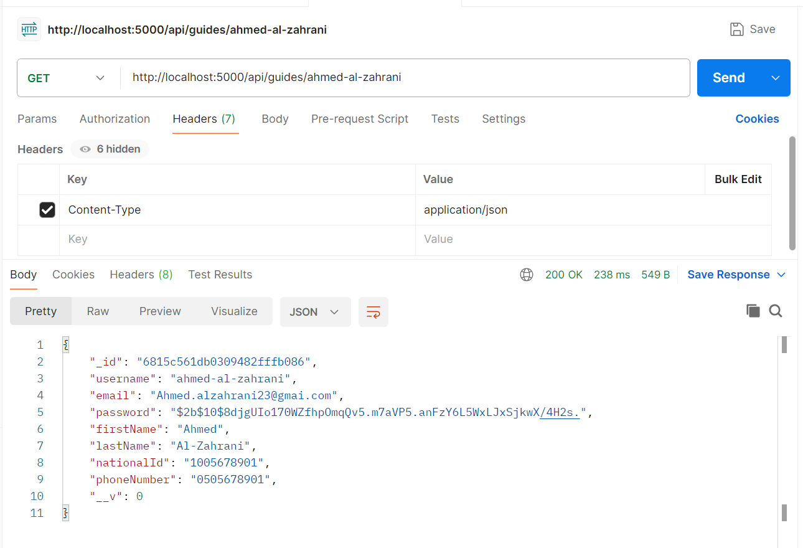

# Jadwill

**SWE 363 - Phase 4 - Front-End Prototype**

## Project Description

**Jadwill** is a dynamic platform designed to transform the travel experience by connecting tourists with local guides who curate one-day itineraries filled with authentic activities and cultural experiences.

Through Jadwill:
- **Locals** can design and post full-day schedules for a set fee.
- **Businesses and organizations** can showcase upcoming events and experiences.
- **Tourists** can explore the region through personalized and immersive cultural interactions.

Jadwill addresses the challenge of impersonal, generic tourism by enabling authentic cultural exchanges, supporting small businesses, and promoting economic growth in alignment with Saudi Vision 2030.

### Target Users
- **Admin:** Manages user accounts, handles registrations, monitors statistics, and resolves complaints.
- **Tourists:** Search for, book, and review local experiences.
- **Tour Guides:** Create and manage custom tours, communicate with tourists.
- **Activity Providers:** Post and manage activities, handle bookings and customer interactions.

## Technologies Used
- **React**
- **React Router**
- **Node.js**
- **Bootstrap**
- **React Bootstrap Icons**
- **React Calendar**
- **React Datepicker**

## Installation Instructions

1. **Clone the repository:**
```bash
git clone https://github.com/SarahAlabkari/SWE363_Project.git
```

2. **Navigate into the project directory:**
```bash
cd SWE363_Project
```

3. **Install all required dependencies:**
```bash
npm install
```

4. **(Optional) Install specific libraries manually if needed:**
```bash
npm install react-router-dom
npm install bootstrap
npm install react-bootstrap-icons
npm install react-calendar
npm install react-datepicker
```

Usually `npm install` is enough to install everything.

## Running the Project

- Start the development server locally:
```bash
npm start
```

- The project will run at:
```
http://localhost:3000/Home
```

- **No environment variables are required.**

## Folder Structure

```
SWE363_Project/
├── public/                 # Public assets (images, logos, icons)
├── src/
│   ├── components/         # Reusable UI components (e.g., CalendarView, MenuBar, ActivityCard)
│   ├── pages/              # Pages/screens (e.g., Home, About, GuideProfile, TourCenter)
│   ├── styles/             # Page-specific CSS files
│   ├── App.js              # Main React component defining routes
│   ├── App.css             # Global styling for the app
│   ├── index.js            # React app entry point
│   ├── index.css           # Basic reset and global CSS
│   └── reportWebVitals.js  # Performance measurement file (optional)
├── .gitignore              # Git ignored files and folders
├── README.md               # Project documentation
├── package.json            # Project metadata and dependencies
├── package-lock.json       # Exact dependency tree for reproducibility
```

## Special Notes

- You must have **Node.js** installed.
- Public images like **logos** and **icons** are stored in the `/public` folder.

## Simulated Functionalities

**Login Simulation:**
- Since the system is not yet connected to a real database, we simulate login functionality by using predefined users stored directly in the frontend code.
- Users can log in using either their **username** or **email**, along with the correct **password**.
- The available credentials are:

| Role                  | Username     | Email                  | Password       |
|------------------------|--------------|------------------------|----------------|
| Admin                  | admin        | admin@jadwill.com      | admin123        |
| Activity Provider      | provider     | provider@jadwill.com   | provider123     |
| Tour Guide             | guide        | guide@jadwill.com      | guide123        |
| Tourist                | tourist      | tourist@jadwill.com    | tourist123      |

After logging in, users are redirected to their specific landing pages according to their role.

**Password Reset Simulation:**
- Since the platform is not yet linked to a real email service,  
clicking **"Send Request"** on the "Forget Password" page will **directly redirect** the user to the **Reset Password** page after a short success message.
- In a fully connected system, this action would instead send an actual email containing a password reset link.

## 📦 Phase 5: Back-End Integration & API Testing

This phase demonstrates the successful connection between the **backend**, **MongoDB database**, and **Postman API testing** for authentication and data retrieval of **Jadwill** actors.

---

### 🛠️ Backend Setup

#### 1. Navigate to the backend directory:

```bash
cd backend
```

#### 2. Install Dependencies:

```bash
npm install
```

#### 3. Create a `.env` file with the following variables:

```
PORT=5000
MONGO_URI=your_mongodb_connection_string
JWT_SECRET=your_jwt_secret_key
JWT_EXPIRES_IN=3d
```

⚠️ Do **not** push the `.env` file to GitHub as it contains sensitive information.

#### 4. Start the Backend Server:

```bash
node server.js
```

#### 5. Run the Front-End from a new terminal:

```bash
npm start
```

---

### 📁 Folder Structure of `backend/`

```
backend/
├── config/             # MongoDB connection setup (db.js)
├── controllers/        # Logic for routes (e.g., authController.js, guideController.js)
├── models/             # Mongoose schemas (e.g., Guide.js, Admin.js)
├── routes/             # Route definitions (e.g., authRoutes.js, guideRoutes.js)
├── utils/              # Helper functions (e.g., validation, hashing)
├── .gitignore          # Files to ignore in Git
├── package.json        # Project metadata and dependencies
├── package-lock.json   # Dependency lock file
├── server.js           # Main backend server file
```

---

## 🧪 Postman Test Cases

### ✅ 1. Guide Login – Successful

**POST** `http://localhost:5000/api/auth/login`

```json
{
  "identifier": "ahmed-al-zahrani",
  "password": "qwqwqw"
}
```

📸 Screenshot:


---

### ❌ 2. Guide Login – Invalid Credentials

**POST** `http://localhost:5000/api/auth/login`

```json
{
  "identifier": "farah_al_mutairi",
  "password": "farah123"
}
```

📸 Screenshot:


---

### ✅ 3. GET Guide by Username

**GET** `http://localhost:5000/api/guides/ahmed-al-zahrani`

**Headers:**

```
Content-Type: application/json
```

**Response:**

```json
{
  "_id": "6815c561db0309482fff0b86",
  "username": "ahmed-al-zahrani",
  "email": "Ahmed.alzahrani23@gmail.com",
  "firstName": "Ahmed",
  "lastName": "Al-Zahrani",
  "nationalId": "1005678901",
  "phoneNumber": "0505678901",
  "__v": 0
}
```

📸 Screenshot:


---

## 📌 Notes

* All screenshots are stored inside the `screenshots/` folder at the project root.
* These APIs are **live** only if your server is running on `localhost:5000` and properly connected to MongoDB.

## 👩‍💻 Contributors

Developed by **Team 21**:

* Lamees Alikhwan
* Sarah Alabkari
* Nora Alkuwaihes
* Reem Abdelgawad
* Walah Alrobayan
* Aminah Laznam

